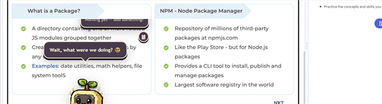

# 🌱 Sprout Desktop

A tiny pixel-art companion that lives on your desktop.

Sprout is a desktop companion designed to feel less like a traditional productivity app and more like a tiny creature living alongside you while you work.
It can move around your desktop, react to interactions, display emotions, and support simple productivity features such as to-do lists and reminders.

> **Platform note:** Sprout currently only runs on **Windows**. The transparent, click-through, always-on-top overlay is built against Windows-specific Electron behavior — macOS/Linux support doesn't exist yet.

## 📸 Demo




## ✨ Features

* 🌱 Pixel-art desktop companion
* 🚶 Natural idle and walking behavior
* 👀 Idle animations and blinking
* 😊 Interactive reactions and emotions
* 🖱️ Click interactions, escalating with click speed
* 📋 Local to-do list
* 💻 Productivity animations with a laptop
* 🔔 Desktop reminders — a real back-and-forth (Yes / Done / Remind me later), with Sprout reacting emotionally to your answer and getting a little more insistent the more you snooze
* 😴 Background moods driven by how many to-dos are piling up
* 🪟 Transparent desktop overlay
* 📌 Always-on-top window
* 🖥️ Windows desktop support
* 📦 Packaged as a standalone application

## 🧠 The Idea

The goal of Sprout is to create a small digital companion that feels alive.
Instead of opening another productivity application, the experience should feel more like:

> "There's a tiny creature living on my desktop that happens to care whether I'm getting things done."

Sprout is designed to have natural moments of activity and rest. Sometimes it walks, reacts, or interacts with the user—and sometimes it simply stays still.

## 🛠️ Built With

* React
* Vite
* Electron
* JavaScript
* Electron Builder

## 🚀 Getting Started

### Prerequisites

Make sure you have Node.js installed. Electron Builder also relies on native build tools for packaging — if `npm run dist` fails on build-tool errors, that's a machine setup issue to resolve separately from the app itself.

### Installation

Navigate into the project:

```bash
cd Sprout-desktop
```

Install dependencies:

```bash
npm install
```

Run Sprout in development mode:

```bash
npm run dev
```

## 📦 Build

To create a production build:

```bash
npm run build
```

To package the application:

```bash
npm run dist
```

## 🌱 Project Vision

The long-term goal of Sprout is to create a companion that feels responsive and expressive without becoming distracting or annoying.

**Scoped, not yet built:**

* 🎭 More personality emotions (excited, proud, wave, look-around, dance) — waiting on art
* 🖱️ A refined click-reaction tier system

**Further out, deliberately deferred:**

* 📅 Calendar integration
* 🤖 Optional AI interactions
* 🧩 Additional desktop interactions
* 🔔 Smarter reminders

## 📁 Project Status

🚧 Currently in development

Sprout is an experimental project and is actively being developed.

## 🎯 Learning Goals

This project is also a way to explore and learn:

* Desktop application development
* Electron
* React
* State management
* Animation systems
* Event-driven programming
* Desktop application packaging

## 🤝 AI-Assisted Development

Sprout was developed using an AI-assisted workflow for implementation, debugging, and development support.
The project idea, creative direction, feature decisions, and iterative feedback were guided by the project creator. AI tools were used as development assistants during the building process.

The goal is to continue learning and understanding the technologies and architecture behind the project while developing it.

---

Made with 🌱 and curiosity.
